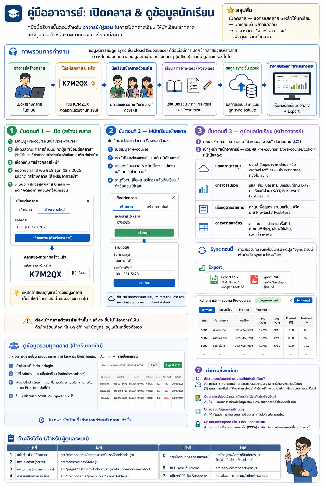

# คู่มืออาจารย์: เปิดคลาส & ดูข้อมูลนักเรียน

คู่มือนี้อธิบายขั้นตอนสำหรับ **อาจารย์/ผู้สอน** ในการเปิดคลาสเรียน ให้นักเรียนเข้าคลาส
และดูความคืบหน้า–คะแนนของนักเรียนแต่ละคน

> สรุปสั้น: เปิดคลาส → ได้ **รหัสเข้าคลาส** (แจกนักเรียน ผ่าน QR/ลิงก์ได้) +
> **รหัสอาจารย์** (เก็บส่วนตัว) → นักเรียนเรียน/ทำข้อสอบ
> → อาจารย์กด **"สำหรับอาจารย์"** เพื่อดูผลรวมทั้งคลาส



---

## ภาพรวมการทำงาน

ข้อมูลนักเรียนถูก sync ขึ้น cloud (Supabase) **ก็ต่อเมื่อมีการเปิด/เข้าคลาสด้วยรหัสคลาส**
ถ้ายังไม่เชื่อมต่อคลาส ข้อมูลจะอยู่ในเครื่องนั้น ๆ (offline) เท่านั้น ดูข้ามเครื่องไม่ได้

```
อาจารย์สร้างคลาส ──> ได้รหัสคลาส 6 หลัก (เช่น K7M2QX)
        │
        └─ แจกรหัสให้นักเรียน
                │
   นักเรียนแต่ละคน "เข้าคลาส" ด้วยรหัส ──> เรียน / ทำ Pre-test / Post-test
                │
        ผลถูก sync ขึ้น cloud อัตโนมัติ
                │
   อาจารย์เปิดหน้า "สำหรับอาจารย์" ──> เห็นผลนักเรียนทั้งคลาส + Export
```

---

## ขั้นตอนที่ 1 — เปิด (สร้าง) คลาส

1. เข้า **หน้าอาจารย์**: เมนู **More → "สำหรับอาจารย์"** (เข้าได้จากทุกหน้า)
   หรือที่หน้า **Pre-course** กดปุ่ม **"สำหรับอาจารย์"**
2. ถ้ายังไม่มีคลาส หน้าจะแสดงการ์ด **"ยังไม่ได้เชื่อมต่อคลาส"** พร้อมขั้นตอน 1-2-3
   — กดปุ่ม **"สร้างคลาสใหม่ (สำหรับอาจารย์)"**
3. กรอกชื่อคลาส เช่น `BLS รุ่นที่ 12 / 2025` แล้วกด **"สร้างคลาส"**
4. ระบบจะแสดง **รหัส 2 ชุด**:
   - **รหัสเข้าคลาส** — แจกให้นักเรียนใช้เข้าคลาส (แสดงค้างบนหน้าอาจารย์
     พร้อม QR + ปุ่มคัดลอก กลับมาดู/แจกซ้ำได้ตลอด)
   - **รหัสอาจารย์** — **เก็บเป็นความลับ อย่าแจกนักเรียน** ใช้ดูผลรวมทั้งคลาส
     และใช้เชื่อมต่อคลาสนี้บนเครื่อง/เบราว์เซอร์อื่น จดเก็บไว้ให้ดี

> ถ้ามีรหัสอาจารย์อยู่แล้ว (เช่น สร้างคลาสไว้จากเครื่องอื่น) กด
> **"มีรหัสอาจารย์อยู่แล้ว? เชื่อมต่อด้วยรหัส"** แทน — ระบบจะแสดงรหัสเข้าคลาสให้ด้วย
>
> 🔐 ทำไมต้องมี 2 รหัส? รหัสเข้าคลาสอยู่ในมือนักเรียนทุกคน ถ้าใช้ดูผลรวมได้
> นักเรียนก็จะเห็นชื่อ-เบอร์-คะแนนของเพื่อนทั้งคลาส — รหัสอาจารย์จึงเป็นตัวปลดล็อกส่วนนี้แทน
> (คลาสที่สร้างก่อนระบบนี้ยังใช้รหัสเดิมดูผลรวมได้ตามเดิม)

> 💡 รหัสอาจารย์เป็นกุญแจเข้าถึงผลรวมของคลาส ใครมีรหัสนี้จะดู (และลบ) ข้อมูลนักเรียนได้
> — เก็บไว้กับตัวเท่านั้น

---

## ขั้นตอนที่ 2 — ให้นักเรียนเข้าคลาส

**วิธีที่ง่ายที่สุด: QR / ลิงก์เข้าคลาส**
บนการ์ดคลาสในหน้าอาจารย์มี **QR code** และปุ่ม **"ลิงก์เข้าคลาส"** —
ฉาย QR ขึ้นจอหรือส่งลิงก์เข้ากลุ่ม LINE นักเรียนสแกน/กดแล้วรหัสจะถูกกรอกให้อัตโนมัติ
กด "เข้าคลาส" อีกครั้งเดียวเป็นอันเสร็จ

หรือกรอกรหัสเอง — นักเรียนแต่ละคนทำบนเครื่องของตัวเอง:

1. เปิดเมนู **Pre-course**
2. กด **"เชื่อมต่อคลาส"** → แท็บ **"เข้าคลาส"**
3. กรอก**รหัสเข้าคลาส** 6 หลักที่อาจารย์แจก แล้วกด **"เข้าคลาส"**
4. ระบุตัวตน (ชื่อ–เบอร์โทร) แล้วเริ่มเรียน / ทำข้อสอบได้เลย

ตั้งแต่นี้ ผลการอ่านบทเรียน, Pre-test และ Post-test ของนักเรียนจะ sync ขึ้น cloud อัตโนมัติ

> ⚠️ ต้อง **เข้าคลาสด้วยรหัส** เท่านั้น ผลถึงจะขึ้นไปให้อาจารย์เห็น
> ถ้านักเรียนเลือก "โหมด offline" ข้อมูลจะอยู่แค่ในเครื่องตัวเอง

---

## ขั้นตอนที่ 3 — ดูข้อมูลนักเรียน (หน้าอาจารย์)

เข้าหน้าอาจารย์ได้ **2 ทาง**:

- **เมนู More → "สำหรับอาจารย์"** (ไอคอน 👥) — เข้าได้จากทุกหน้า สะดวกที่สุด
- หรือที่หน้า **Pre-course** กดปุ่ม **"สำหรับอาจารย์"** แถวหัวข้อ *"บทเรียน"*

ทั้งสองทางจะเข้าสู่หน้า **"หน้าอาจารย์ — รวมผล Pre-course"** (`/pre-course/cohort`)

หน้านี้แสดง:

| ส่วน | รายละเอียด |
|------|-----------|
| แถบสถานะข้อมูล | บอกว่าข้อมูลมาจาก **cloud** หรือ **cached (offline)** + จำนวนรายการที่ยังไม่ sync |
| ตารางสรุปรวม | รหัส, ชื่อ, เบอร์โทร, บทเรียนที่อ่าน (X/Y), บทเรียนที่ผ่าน (X/Y), Pre-test %, Post-test % |
| เลือกดูตามรายการ | กดปุ่มเพื่อดูเจาะรายบทเรียน หรือราย Pre-test / Post-test |
| ตารางรายละเอียด | สถานะอ่าน, จำนวนครั้งที่ทำ, คะแนนดีที่สุด, ผ่าน/ไม่ผ่าน, เวลาที่ทำล่าสุด |

> หน้านี้จะดึงจาก cloud อัตโนมัติเมื่อ **มีรหัสคลาส + ออนไลน์**
> ถ้าออฟไลน์หรือยังไม่ได้เข้าคลาส จะแสดงข้อมูลในเครื่องแทน

### Sync ตอนนี้
ถ้าผลของนักเรียนยังไม่ขึ้นครบ กดปุ่ม **"Sync ตอนนี้"** เพื่อบังคับ sync แล้วรอสักครู่

### Export
- **Export CSV** — เปิดใน Excel / Google Sheets ได้
- **Export PDF** — สำหรับเก็บหลักฐานหรือพิมพ์

### โหลดคู่มือนี้
ในหน้าอาจารย์มีปุ่ม **"คู่มือ (PDF)"** มุมขวาบน กดเพื่อเปิด/ดาวน์โหลดคู่มือฉบับนี้เก็บไว้อ่านหรือพิมพ์ได้

---

## ดูข้อมูลรวมทุกคลาส (สำหรับแอดมิน)

ถ้าต้องการดู **รายชื่อนักเรียนข้ามทุกคลาส** ในที่เดียว ใช้หน้าแอดมิน:

1. เข้าสู่ระบบที่ `/admin/login`
2. ไปที่ **Admin → รายชื่อนักเรียน** (`/admin/students`)
3. เห็นรายชื่อนักเรียนทุกคลาส: ชื่อ, เบอร์, คลาส, รหัสคลาส, คอร์ส, สถานะ Post-test, วันที่เข้า
4. ค้นหา (ชื่อ/เบอร์/คลาส) และ Export CSV ได้

> นับเฉพาะนักเรียนที่ **เข้าคลาสด้วยรหัสคลาส** เท่านั้น

---

## คำถามที่พบบ่อย

**Q: เปิดคลาสแล้วแต่หน้าอาจารย์ไม่เห็นนักเรียน?**
A: ตรวจว่า (1) นักเรียนเข้าคลาสด้วย **รหัสเดียวกัน** จริง (2) เครื่องอาจารย์ออนไลน์อยู่
(3) แถบสถานะขึ้นว่า "ข้อมูลจาก cloud" ถ้าขึ้น offline แปลว่ายังไม่เชื่อมต่อคลาสบนเครื่องนี้

**Q: อาจารย์ต้องเข้าคลาสด้วยรหัสเดียวกับนักเรียนไหม?**
A: ไม่ — อาจารย์ใช้ **รหัสอาจารย์** (หน้าอาจารย์จะดึงผลรวมจาก cloud ด้วยรหัสนี้)
ส่วนนักเรียนใช้ **รหัสเข้าคลาส** คลาสรุ่นเก่าที่มีรหัสเดียวยังใช้รหัสเดิมได้ทั้งสองอย่าง

**Q: เปลี่ยน/สลับคลาสได้ไหม?**
A: ได้ — ที่หน้าอาจารย์กด **"เชื่อมต่อคลาสอื่น"** (หรือ **"สร้างคลาสใหม่"**)
ข้อมูลคลาสเดิมไม่หาย กลับมาเชื่อมต่อด้วยรหัสเดิมได้ตลอด

**Q: รหัสหายทำอย่างไร?**
A: ถ้ามี **รหัสอาจารย์** เชื่อมต่อคลาสอีกครั้งจะเห็นรหัสเข้าคลาสด้วย
ถ้าหายทั้งคู่ ให้แอดมินเปิดดูที่ **Admin → คลาสทั้งหมด** (`/admin/classes`)

**Q: จบการอบรมแล้ว ปิดคลาสได้ไหม?**
A: ได้ — แอดมินกด **"ปิดคลาส"** ที่ `/admin/classes` รหัสทั้งคู่จะใช้ไม่ได้
(ข้อมูลยังอยู่ครบ เปิดคลาสอีกครั้งได้)

**Q: ข้อมูลส่วนบุคคล (ชื่อ–เบอร์) ปลอดภัยไหม?**
A: ใช้ภายในเพื่อการอบรมเท่านั้น (PDPA) ผลรวมทั้งคลาสเข้าถึงได้เฉพาะผู้ถือ
**รหัสอาจารย์** หรือสิทธิ์แอดมินเท่านั้น — รหัสเข้าคลาสของนักเรียนใช้ดูไม่ได้

---

## อ้างอิงโค้ด (สำหรับผู้ดูแลระบบ)

| หน้าที่ | ไฟล์ |
|--------|------|
| หน้าต่างเปิด/เข้าคลาส | `src/components/precourse/ClassGateModal.jsx` |
| สถานะคลาส (state) | `src/stores/classStore.js` |
| หน้าอาจารย์ (รวมผลคลาส) | `src/pages/InstructorCohort.jsx` (route `/pre-course/cohort`) |
| ตารางแสดงผลนักเรียน | `src/components/precourse/CohortTable.jsx` |
| รายชื่อรวมทุกคลาส (แอดมิน) | `src/pages/AdminStudents.jsx` (route `/admin/students`) |
| RPC sync กับ cloud | `src/services/cohortSync.js` |
| สคีมา/RPC ฝั่ง Supabase | `supabase-cleanup/cohort-sync.sql` |
