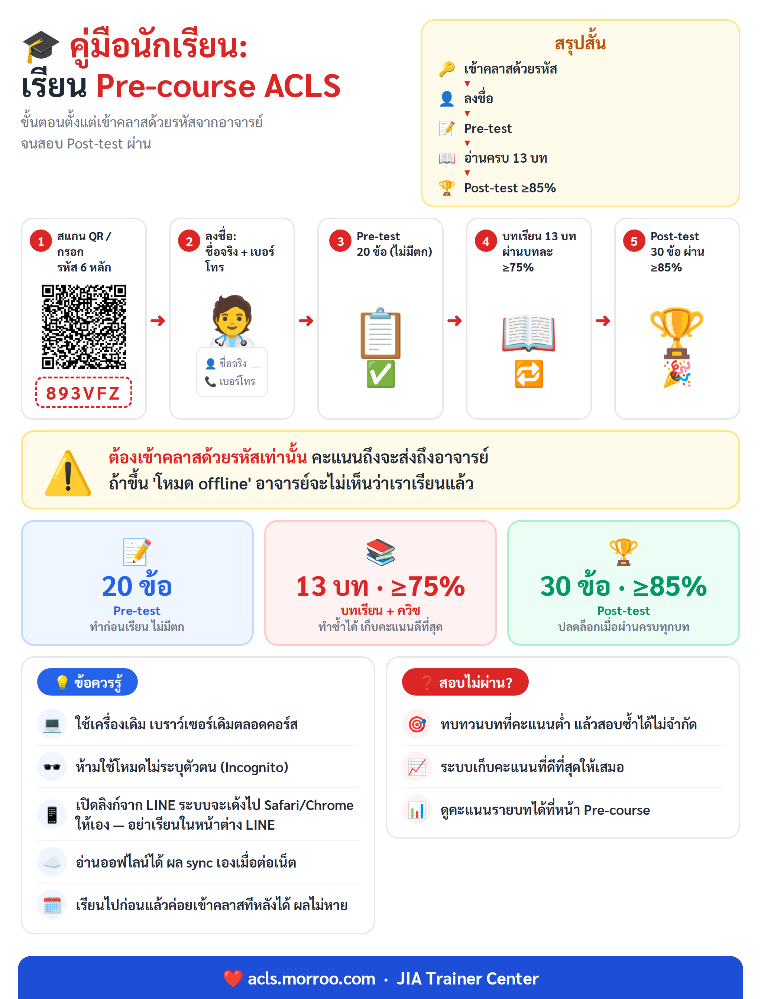

# คู่มือนักเรียน: เรียน Pre-course ACLS

คู่มือนี้อธิบายขั้นตอนสำหรับ **นักเรียน/ผู้เข้าอบรม** ตั้งแต่เข้าคลาสด้วยรหัสจากอาจารย์
ไปจนถึงสอบ Post-test ผ่าน — อ่านจบใน 5 นาที ทำตามได้ทันที

> สรุปสั้น: **เข้าคลาสด้วยรหัสจากอาจารย์ → ลงชื่อ → ทำ Pre-test →
> อ่านบทเรียน 13 บทให้ผ่านครบ → สอบ Post-test ให้ได้ ≥85%**
> ผลทุกอย่างส่งถึงอาจารย์อัตโนมัติ ไม่ต้องส่งอะไรเพิ่ม



> ⚠️ QR และรหัส `893VFZ` ในภาพเป็นของคลาส **ALS RAM 1/7/67** —
> รุ่นอื่นให้ใช้ QR/รหัสของคลาสตัวเองจากหน้าอาจารย์
> (ต้นฉบับแก้ไขได้ที่ `docs/student-precourse-guide-infographic.html`)

---

## ภาพรวมการเรียน

```
สแกน QR / กรอกรหัสเข้าคลาส 6 หลัก (ได้จากอาจารย์)
        │
   ลงชื่อ: ชื่อ–นามสกุลจริง + เบอร์โทร
        │
   ① Pre-test 20 ข้อ ── วัดพื้นฐานก่อนเรียน (ทำตามจริง ไม่มีตก)
        │
   ② บทเรียน 13 บท ── อ่าน + ตอบควิซ ต้องได้ ≥75% ต่อบท (ทำซ้ำได้)
        │
   ③ Post-test 30 ข้อ ── ปลดล็อกเมื่อผ่านครบ 13 บท ต้องได้ ≥85%
        │
   ผล sync ขึ้น cloud อัตโนมัติ ──> อาจารย์เห็นความคืบหน้าของเรา
```

---

## สิ่งที่ต้องเตรียม

- **มือถือ แท็บเล็ต หรือคอมพิวเตอร์** เครื่องใดก็ได้ 1 เครื่อง — แต่ **ใช้เครื่องเดิม
  เบราว์เซอร์เดิมตลอดคอร์ส** เพราะความคืบหน้าเก็บไว้ในเครื่องนั้น
- เบราว์เซอร์ Chrome / Safari / Edge เวอร์ชันใหม่ (ห้ามใช้โหมดไม่ระบุตัวตน / Incognito)
- **รหัสเข้าคลาส 6 หลัก** ที่อาจารย์แจก (เช่น `893VFZ`) หรือ QR / ลิงก์เข้าคลาส
- อินเทอร์เน็ตตอนเข้าคลาสครั้งแรก — หลังจากนั้นอ่านบทเรียนแบบออฟไลน์ได้

> 💡 แนะนำติดตั้งเป็นแอป: เปิดเว็บใน Chrome/Safari แล้วกด **"Add to Home Screen"**
> หรือ **"ติดตั้ง"** จะได้ไอคอนบนหน้าจอ เปิดเรียนต่อได้เร็วขึ้น

---

## ขั้นตอนที่ 1 — เข้าคลาสด้วยรหัสจากอาจารย์

**วิธีที่ง่ายที่สุด: สแกน QR หรือกดลิงก์** ที่อาจารย์ฉายขึ้นจอ/ส่งเข้ากลุ่ม LINE
— รหัสจะถูกกรอกให้อัตโนมัติ กดปุ่ม **"เข้าคลาส"** อีกครั้งเดียวเป็นอันเสร็จ

> 📱 สแกน/กดลิงก์จากใน LINE ได้เลย — ระบบจะเด้งไปเปิดใน **Safari/Chrome** ให้เอง
> **อย่าเรียนในหน้าต่างของ LINE** เพราะผลการเรียนจะไปเก็บผิดที่และอาจหาย
> ถ้าเห็นหน้าเตือนสีเข้มพร้อมปุ่ม "เปิดในเบราว์เซอร์" ให้กดปุ่มนั้นก่อนเริ่มเรียน

หรือกรอกรหัสเอง:

1. เปิดหน้า **Pre-course** (เมนู **เรียนรู้** → **Pre-course**)
2. ถ้ามีหน้าต่างถามเรื่องคลาสเด้งขึ้นมา กด **"มีรหัสคลาสจากอาจารย์? เข้าคลาส"**
   (ถ้าไม่เด้ง กดปุ่ม **"เชื่อมต่อคลาส"** ที่การ์ดสถานะบนหน้า Pre-course)
3. กรอก**รหัสเข้าคลาส 6 หลัก** แล้วกด **"เข้าคลาส"**
4. การ์ดบนหน้า Pre-course ต้องเปลี่ยนเป็น **"คลาส: (ชื่อคลาส)"** พร้อมไอคอนเมฆ ☁️
   — ถ้ายังขึ้น **"โหมด offline"** แปลว่ายังไม่ได้เข้าคลาส

> ⚠️ สำคัญที่สุดในคู่มือนี้: ต้อง **เข้าคลาสด้วยรหัส** เท่านั้น
> คะแนนถึงจะส่งขึ้นไปให้อาจารย์เห็น ถ้าเรียนใน "โหมด offline"
> ผลจะอยู่แค่ในเครื่องตัวเอง อาจารย์จะไม่เห็นว่าเราเรียนแล้ว

---

## ขั้นตอนที่ 2 — ลงชื่อผู้เรียน

ครั้งแรกที่เริ่มเรียน/ทำข้อสอบ ระบบจะให้ **"ระบุตัวผู้เรียน"**:

- **ชื่อ–นามสกุล** — ใช้**ชื่อจริง**ตามที่ลงทะเบียนอบรม เพราะอาจารย์ใช้ชื่อนี้ตรวจผล
- **เบอร์โทร** — ใช้แยกคนชื่อซ้ำและติดต่อกลับ
- บางคลาสมีช่อง **รหัสนักเรียน** เพิ่ม — กรอกตามที่อาจารย์กำหนด

ชื่อ–เบอร์ถูกเก็บในเครื่องและส่งให้อาจารย์ผู้สอนเท่านั้น (ใช้ภายในการอบรมตาม PDPA)
ถ้าพิมพ์ผิดหรือใช้เครื่องร่วมกับคนอื่น กดปุ่ม **"เปลี่ยน"** ที่การ์ดชื่อบนหน้า Pre-course
เพื่อแก้ไข/สลับผู้เรียนได้

---

## ขั้นตอนที่ 3 — ทำ Pre-test (ข้อสอบก่อนเรียน)

- ข้อสอบปรนัย **20 ข้อ** ทำ**ก่อน**อ่านบทเรียน
- เป็นการวัดพื้นฐานเพื่อเทียบพัฒนาการกับ Post-test — **ทำตามความรู้จริง ไม่ต้องเปิดหาคำตอบ
  และคะแนน Pre-test ไม่มีผลตก** ไม่ว่าได้เท่าไรก็เรียนต่อได้ทันที
- ทำเสร็จจะเห็นเฉลยพร้อมคำอธิบายทุกข้อ — อ่านเฉลยตรงนี้ได้ความรู้เยอะมาก อย่าข้าม

---

## ขั้นตอนที่ 4 — อ่านบทเรียนให้ผ่านครบ 13 บท

บทเรียนทั้งหมด 13 บท เรียงตามลำดับที่แนะนำ:

| บท | เนื้อหา |
|----|---------|
| 1 | ภาพรวม ACLS และห่วงโซ่การรอดชีวิตสากล |
| 2 | การประเมินผู้ป่วยอย่างเป็นระบบ |
| 3 | ป้องกัน Arrest · RRT/MET + SBAR |
| 4 | กลุ่มอาการหลอดเลือดหัวใจเฉียบพลัน (ACS) |
| 5 | โรคหลอดเลือดสมองเฉียบพลัน (Acute Stroke) |
| 6 | ภาวะหัวใจเต้นช้าแบบมีชีพจร |
| 7 | ภาวะหัวใจเต้นเร็วแบบมีชีพจร |
| 8 | ทีมช่วยชีวิตสมรรถนะสูง + CPR Coach |
| 9 | การจัดการทางเดินหายใจ |
| 10 | ภาวะหัวใจหยุดเต้น VF/pVT (Shockable) |
| 11 | ภาวะหัวใจหยุดเต้น PEA/Asystole |
| 12 | การดูแลหลังภาวะหัวใจหยุดเต้น (Post-ROSC) |
| 13 | เภสัชวิทยาใน ACLS (Pharmacology) |

**วิธีเรียนแต่ละบท**

1. กดเข้าบทจากหน้า Pre-course — เนื้อหาแบ่งเป็นหน้าสั้น ๆ อ่านทีละหน้า กด "ถัดไป"
2. ระหว่างทางมี**ควิซแทรก** ต้องเลือกคำตอบก่อนจึงไปต่อได้ พร้อมเฉลยทันที
3. จบบทจะเห็นคะแนน — **ผ่านเมื่อได้ ≥75%** ของควิซในบทนั้น
4. ไม่ผ่านหรืออยากได้คะแนนดีกว่าเดิม **ทำซ้ำได้ไม่จำกัด** ระบบเก็บคะแนนที่ดีที่สุด
5. อ่านค้างไว้แล้วปิดแอปได้ — กลับมาจะมีปุ่มให้ทำต่อจากจุดเดิม

> 💡 อ่านแบบออฟไลน์ได้ (เช่น บนรถไฟฟ้า) ผลจะถูกส่งขึ้นให้อาจารย์เอง
> เมื่อกลับมาต่อเน็ต

---

## ขั้นตอนที่ 5 — สอบ Post-test (ข้อสอบหลังเรียน)

- ปลดล็อกเมื่อ **ผ่านบทเรียนครบทั้ง 13 บท** เท่านั้น
- ข้อสอบปรนัย **30 ข้อ** — เกณฑ์ผ่าน **≥85%**
- ไม่ผ่านสอบซ้ำได้ (ชุดคำถามจะสลับใหม่) ระบบเก็บคะแนนที่ดีที่สุด
- ผ่านแล้วถือว่าจบ Pre-course — พร้อมเข้าอบรมภาคปฏิบัติ

---

## ตัวช่วยการเรียนเพิ่มเติม

- **คลิปวิดีโอบทเรียน** — เมนู **เรียนรู้ → วิดีโอบทเรียน** มีคลิปสรุปแต่ละหัวข้อ
  พร้อมลิงก์โยงกลับไปบทเรียนที่เกี่ยวข้อง เหมาะดูก่อน/หลังอ่านบท
- **เครื่องคำนวณยา** — เมนู **ยา** กรอกน้ำหนักผู้ป่วยแล้วดูขนาดยา ACLS ทั้งหมด
- **โจทย์ฝึกสถานการณ์จำลอง** — เมนู **โจทย์/ฝึกซ้อม** ลองคุมเคสเสมือนจริงหลังเรียนจบ
- **ถาม-ตอบ ACLS เชิงลึก** — รวมคำถามที่นักเรียนถามบ่อยพร้อมคำตอบจากอาจารย์

---

## คำถามที่พบบ่อย

**Q: เผลอเรียนไปหลายบทแล้วเพิ่งได้รหัสคลาส ต้องเริ่มใหม่ไหม?**
A: ไม่ต้อง — พอเข้าคลาสด้วยรหัส ผลที่ทำไว้ก่อนหน้าในเครื่องนี้จะถูกส่งขึ้นให้อาจารย์ให้เอง

**Q: เน็ตหลุดกลางบทเรียน/กลางข้อสอบ?**
A: เรียนต่อได้ปกติ (แอปทำงานออฟไลน์ได้) ผลจะ sync ขึ้นให้อาจารย์เองเมื่อกลับมาออนไลน์

**Q: ทำไมอาจารย์บอกว่าไม่เห็นคะแนนของเรา?**
A: เช็ค 3 อย่าง: (1) การ์ดบนหน้า Pre-course ขึ้น **"คลาส: …"** ไม่ใช่ "โหมด offline"
(2) รหัสคลาสตรงกับที่อาจารย์แจก (3) เครื่องต่อเน็ตอยู่ — จากนั้นเปิดแอปทิ้งไว้สักครู่ให้ sync

**Q: เปลี่ยนมือถือ/คอมกลางคอร์สได้ไหม?**
A: ไม่แนะนำ — ความคืบหน้าเก็บในเครื่องเดิม เครื่องใหม่จะเริ่มนับใหม่
(ผลที่ sync ไปแล้วอาจารย์ยังเห็นอยู่) ถ้าจำเป็นจริง ๆ ให้เข้าคลาสด้วยรหัสเดิม
ลงชื่อ**ชื่อ–เบอร์เดิมให้ตรงเป๊ะ** แล้วเรียนบทที่เหลือต่อ

**Q: ห้ามทำอะไรบ้างถ้าไม่อยากให้ผลหาย?**
A: อย่าเรียนในหน้าต่างของ LINE/Facebook (ให้เปิดใน Safari/Chrome เสมอ)
อย่าใช้โหมดไม่ระบุตัวตน (Incognito) และอย่าล้างข้อมูลเว็บไซต์/cache ของเบราว์เซอร์
ก่อนจบคอร์ส — ข้อมูลการเรียนเก็บอยู่ในเบราว์เซอร์เครื่องนั้น

**Q: สอบ Post-test ไม่ผ่าน ทำอย่างไร?**
A: กลับไปทบทวนบทที่คะแนนต่ำ (ดูคะแนนรายบทได้ที่หน้า Pre-course) แล้วสอบใหม่ได้เลย
ไม่จำกัดจำนวนครั้ง

**Q: ใช้เครื่องเดียวกันกับเพื่อนได้ไหม?**
A: ได้ — กดปุ่ม **"เปลี่ยน"** ที่การ์ดชื่อบนหน้า Pre-course เพื่อสลับผู้เรียน
แต่ทางที่ดีควรใช้เครื่องของตัวเองคนละเครื่อง

---

## อ้างอิงโค้ด (สำหรับผู้ดูแลระบบ)

| หน้าที่ | ไฟล์ |
|--------|------|
| หน้า Pre-course (3 ขั้นตอน + สถานะคลาส) | `src/pages/PreCourse.jsx` (route `/pre-course`) |
| หน้าต่างเข้าคลาส | `src/components/precourse/ClassGateModal.jsx` |
| หน้าต่างลงชื่อผู้เรียน | `src/components/precourse/StudentIdentityModal.jsx` |
| ตัวอ่านบทเรียน + ควิซ | `src/pages/LessonReader.jsx` (route `/pre-course/:lessonId`) |
| ข้อสอบ Pre-test / Post-test | `src/pages/PreTestExam.jsx`, `src/pages/PostTestExam.jsx` |
| เกณฑ์ข้อสอบ (จำนวนข้อ/เปอร์เซ็นต์ผ่าน) | `src/data/assessment.js`, `src/data/activePostTest.js` |
| เนื้อหาบทเรียน 13 บท (เกณฑ์ผ่าน 75%) | `src/data/preCourseContent.js` |
| sync ผลขึ้น cloud | `src/services/cohortSync.js` |
